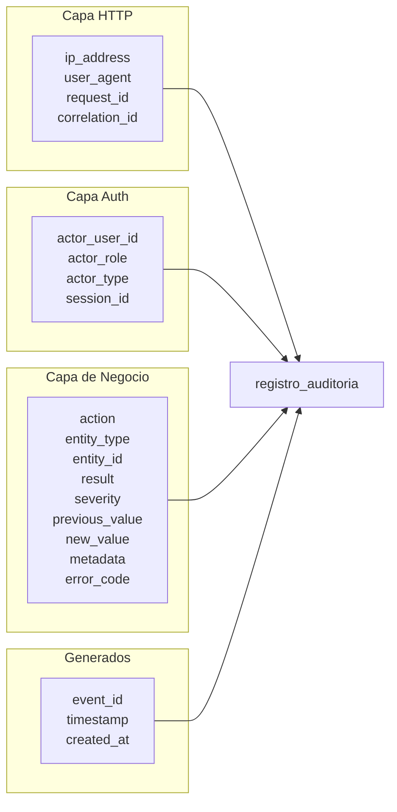
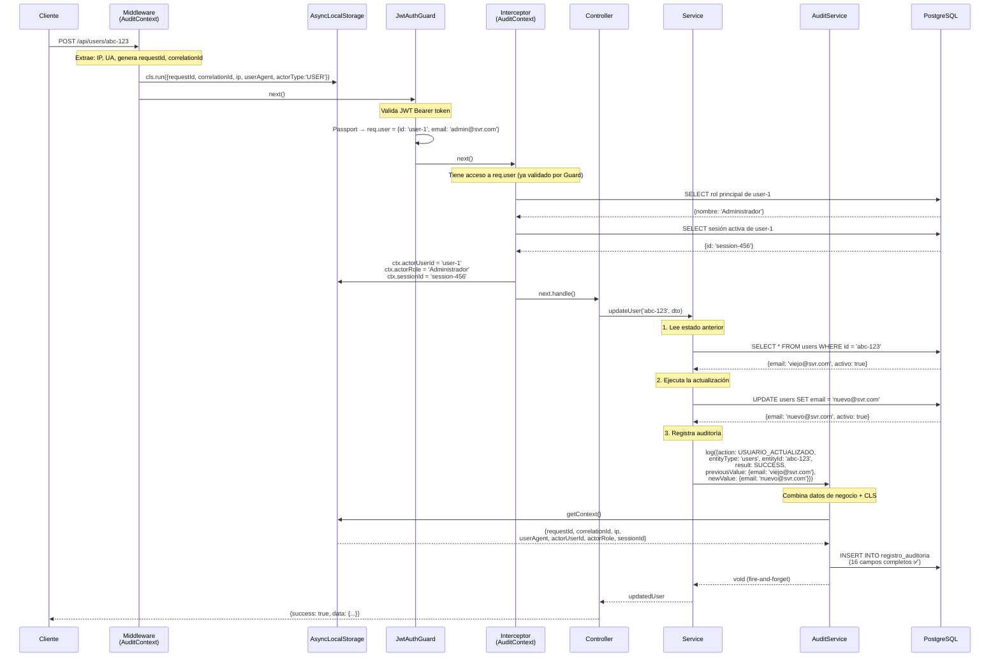
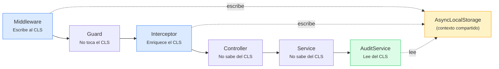
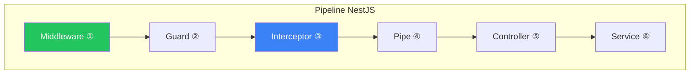

# Servicio Universal de Auditoría — SVR-ERP

## Guía Completa de Implementación: Solución Híbrida

---

## 1. Contexto del Problema

El modelo [`registro_auditoria`](file:///c:/Users/chimi/Documents/GitHub/SVR-ERP/apps/api/prisma/schema.prisma#L1217-L1246) tiene **16 campos** que deben poblarse en cada operación auditada:

```prisma
model registro_auditoria {
  event_id       String        @id @db.Uuid
  timestamp      DateTime      @default(now())
  actor_user_id  String?       @db.Uuid        // ← Del JWT
  actor_role     String                          // ← Del JWT/BD
  actor_type     ActorType                       // ← USER | SYSTEM
  action         AuditAction                     // ← Enum del evento
  entity_type    String                          // ← "users", "maquinas", etc.
  entity_id      String        @db.Uuid         // ← ID del recurso afectado
  result         AuditResult                     // ← SUCCESS | FAIL | DENIED
  severity       AuditSeverity @default(INFO)   // ← INFO | WARNING | CRITICAL
  ip_address     String        @default("unknown")
  user_agent     String        @default("unknown")
  session_id     String?       @db.Uuid
  request_id     String        @db.Uuid         // ← Único por request
  correlation_id String        @db.Uuid         // ← Para agrupar operaciones relacionadas
  error_code     String?
  previous_value Json?                           // ← Snapshot ANTES del cambio
  new_value      Json?                           // ← Snapshot DESPUÉS del cambio
  metadata       Json?                           // ← Datos extra arbitrarios
  created_at     DateTime      @default(now())
  users          users?        @relation(...)
}
```

Los 4 enums:

```prisma
enum ActorType     { USER | SYSTEM }
enum AuditAction   { LOGIN_EXITOSO | LOGIN_FALLIDO | LOGOUT | ... (32 valores) }
enum AuditResult   { SUCCESS | FAIL | DENIED }
enum AuditSeverity { INFO | WARNING | CRITICAL }
```

### El Dilema: ¿Qué Capas Tienen Qué Datos?

Los 16 campos del modelo se originan en **capas distintas** del pipeline de NestJS:



**Ninguna capa individual tiene todos los datos.** Ese es el problema fundamental.

---

## 2. ¿Por Qué la Solución Híbrida?

### Tabla Comparativa Rápida

| Criterio | A: Interceptor Puro | B: Servicio Explícito | **C: Híbrido** |
|----------|:-:|:-:|:-:|
| Campos HTTP automáticos (IP, UA, etc.) | ✅ Automático | ❌ Manual en cada llamada | ✅ Automático |
| Campos de negocio (action, entity, etc.) | ❌ No los tiene | ✅ Explícito | ✅ Explícito |
| `previous_value` / `new_value` | ❌ Imposible | ✅ | ✅ |
| `action` semánticamente correcta | ❌ Solo ve `POST /url` | ✅ | ✅ |
| Operaciones SYSTEM (cron, sin HTTP) | ❌ Requiere HTTP | ✅ | ✅ |
| Resiliencia (error de auditoría no rompe nada) | ✅ | Depende del dev | ✅ Built-in |
| Campos completos por registro | ~8/16 ⭐⭐ | 16/16 ⭐⭐⭐⭐⭐ | 16/16 ⭐⭐⭐⭐⭐ |
| Código repetitivo por endpoint | Ninguno | Alto (IP, UA, reqId...) | **Mínimo** |

> [!IMPORTANT]
> **La opción C combina lo mejor de ambos mundos:** captura automática de datos HTTP (como el interceptor) + control explícito de datos de negocio (como el servicio manual), pero sin código repetitivo.

---

## 3. Arquitectura de la Solución Híbrida

### 3.1 Diagrama de Capas

```
Request HTTP
     │
     ▼
┌──────────────────────────────────────────────────────┐
│ CAPA 1: Middleware — AuditContextMiddleware           │
│ (se ejecuta PRIMERO, antes de guards/interceptors)    │
│                                                       │
│ Crea el contexto CLS con:                             │
│   • requestId  (UUID nuevo)                           │
│   • correlationId  (del header o UUID nuevo)          │
│   • ipAddress  (req.ip)                               │
│   • userAgent  (req.headers['user-agent'])             │
│   • actorType  ('USER' por defecto)                   │
│                                                       │
│ Envuelve todo el request en AsyncLocalStorage          │
├──────────────────────────────────────────────────────┤
│ CAPA 2: Guard — JwtAuthGuard                          │
│ (valida el JWT y coloca req.user = {id, email})       │
├──────────────────────────────────────────────────────┤
│ CAPA 3: Interceptor — AuditContextInterceptor         │
│ (se ejecuta DESPUÉS de los guards)                    │
│                                                       │
│ Enriquece el contexto CLS con datos del JWT:          │
│   • actorUserId  (req.user.id)                        │
│   • actorEmail   (req.user.email)                     │
│   • actorRole    (consulta BD → rol principal)        │
│   • sessionId    (consulta BD → sesión activa)        │
├──────────────────────────────────────────────────────┤
│ CAPA 4: Controller                                    │
│ (delega al Service, no sabe nada de auditoría)        │
├──────────────────────────────────────────────────────┤
│ CAPA 5: Service                                       │
│ (ejecuta la lógica de negocio)                        │
│                                                       │
│ Llama a AuditService.log() con:                       │
│   • action       (USUARIO_CREADO, LOGIN_EXITOSO...)   │
│   • entityType   ('users', 'sessions'...)             │
│   • entityId     (el UUID del recurso afectado)       │
│   • result       (SUCCESS, FAIL, DENIED)              │
│   • previousValue (snapshot antes del cambio)         │
│   • newValue      (snapshot después del cambio)       │
│   • metadata      (datos extra)                       │
│                                                       │
│ ⚡ AuditService obtiene IP, UA, requestId,            │
│    correlationId, actorUserId, actorRole, sessionId   │
│    del CLS automáticamente.                           │
├──────────────────────────────────────────────────────┤
│ CAPA 6: AuditService                                  │
│ (combina datos de negocio + datos CLS)                │
│                                                       │
│ Persiste en PostgreSQL → registro_auditoria           │
│ 16/16 campos ✅                                       │
└──────────────────────────────────────────────────────┘
```

### 3.2 Flujo Completo — Diagrama de Secuencia



### 3.3 Estructura de Archivos

```
apps/api/src/
├── audit/                               # ← MÓDULO NUEVO
│   ├── audit.module.ts                  # Módulo global
│   ├── audit.service.ts                 # Servicio principal (corazón)
│   ├── audit.service.spec.ts            # Tests unitarios
│   ├── audit-context.interceptor.ts     # Enriquece CLS con datos JWT
│   ├── audit-context.middleware.ts      # Inicializa CLS con datos HTTP
│   ├── audit.constants.ts              # Mapeo AuditAction → severity
│   ├── audit.types.ts                  # Interfaces y DTOs
│   ├── cls/
│   │   ├── audit-cls.service.ts        # AsyncLocalStorage wrapper
│   │   └── audit-cls.service.spec.ts   # Tests
│   └── decorators/
│       ├── skip-audit.decorator.ts     # @SkipAudit()
│       └── auditable.decorator.ts      # @Auditable() (metadata)
├── auth/                                # ← YA EXISTE
│   ├── auth.service.ts                  # Se le inyecta AuditService
│   └── ...
├── common/
│   └── filters/
│       └── all-exceptions.filter.ts     # ← SE MODIFICA para auditar errores
├── prisma/
│   ├── prisma.module.ts                 # @Global() — ya existe
│   └── prisma.service.ts               # Ya existe
└── app.module.ts                        # ← SE MODIFICA para registrar AuditModule + middleware
```

---

## 4. Implementación Paso a Paso

### Paso 1: AsyncLocalStorage — El Puente entre Capas

**¿Qué es AsyncLocalStorage?**
Es una API nativa de Node.js (`async_hooks`) que permite propagar datos a lo largo de toda la cadena de ejecución asíncrona de un request, sin pasarlos como parámetros de función en función.

**¿Por qué lo necesitamos?**
Porque el `AuditService` vive en la capa de Services, pero la IP, user-agent, request-id, etc. solo están disponibles en la capa HTTP (middleware/interceptor). Sin CLS, tendríamos que pasar esos datos como parámetros desde el Controller → Service → AuditService en cada llamada, lo cual es el patrón repetitivo que queremos evitar.



```typescript
// ================================================================
// apps/api/src/audit/cls/audit-cls.service.ts
// ================================================================

import { Injectable } from '@nestjs/common';
import { AsyncLocalStorage } from 'async_hooks';

/**
 * Contexto de auditoría que se propaga automáticamente
 * a través de toda la cadena de ejecución del request.
 *
 * Este objeto se crea en el Middleware, se enriquece en el
 * Interceptor, y se lee en el AuditService.
 */
export interface AuditContext {
  /** UUID único de este request HTTP (generado en el middleware) */
  requestId: string;

  /** UUID para agrupar operaciones relacionadas entre servicios */
  correlationId: string;

  /** IP del cliente (extraída de req.ip) */
  ipAddress: string;

  /** User-Agent del navegador/app (extraído de headers) */
  userAgent: string;

  /** Tipo de actor — 'USER' para requests HTTP autenticados, 'SYSTEM' para cron/jobs */
  actorType: 'USER' | 'SYSTEM';

  // --- Los siguientes se llenan en el Interceptor (después del Guard JWT) ---

  /** ID del usuario autenticado (del JWT payload sub) */
  actorUserId?: string;

  /** Email del usuario autenticado */
  actorEmail?: string;

  /** Nombre del rol principal del usuario (consulta a BD) */
  actorRole?: string;

  /** ID de la sesión activa del usuario */
  sessionId?: string;
}

/**
 * Servicio que envuelve AsyncLocalStorage para propagar
 * el contexto de auditoría a lo largo del request.
 *
 * @example
 * // En el Middleware:
 * this.cls.run(context, () => next());
 *
 * // En cualquier Service:
 * const ctx = this.cls.getContext(); // ← Tiene IP, UA, userId, etc.
 */
@Injectable()
export class AuditClsService {
  private readonly storage = new AsyncLocalStorage<AuditContext>();

  /**
   * Ejecuta un callback dentro de un contexto de auditoría.
   * El contexto estará disponible en toda la cadena asíncrona
   * que se ejecute dentro del callback.
   *
   * SOLO debe ser llamado por el Middleware (una vez por request).
   */
  run(context: AuditContext, callback: () => void): void {
    this.storage.run(context, callback);
  }

  /**
   * Obtiene el contexto de auditoría del request actual.
   * Retorna undefined si no hay contexto (ej: cron jobs, tests).
   *
   * Uso típico: dentro de AuditService para leer datos HTTP automáticos.
   */
  getContext(): AuditContext | undefined {
    return this.storage.getStore();
  }

  /**
   * Obtiene el contexto o lanza error si no existe.
   * Usar solo cuando se REQUIERE contexto HTTP (endpoints protegidos).
   */
  getContextOrThrow(): AuditContext {
    const ctx = this.storage.getStore();
    if (!ctx) {
      throw new Error(
        'AuditContext no disponible. ¿Se registró el AuditContextMiddleware?',
      );
    }
    return ctx;
  }

  /**
   * Verifica si hay un contexto activo.
   * Útil para condicionar lógica dependiendo de si estamos
   * en un request HTTP o en una tarea programada.
   */
  hasContext(): boolean {
    return this.storage.getStore() !== undefined;
  }
}
```

> [!NOTE]
> **¿Por qué `AsyncLocalStorage` nativo y no una librería como `cls-hooked` o `nestjs-cls`?**
> Porque `AsyncLocalStorage` es parte del core de Node.js desde la v16, no tiene dependencias externas, no tiene overhead de librerías de terceros y es la API recomendada oficialmente. Es estable, probada y mantiene la trazabilidad correcta a través de Promises, async/await y callbacks.

---

### Paso 2: Middleware — Inicializar el Contexto HTTP

El middleware es el **primer punto de entrada** en el pipeline de NestJS. Se ejecuta ANTES de los Guards, Interceptors, Pipes y Controllers.

**¿Por qué un Middleware y no un Interceptor para esto?**
Porque el middleware puede envolver TODO el pipeline dentro del `cls.run()`, garantizando que el contexto esté disponible en Guards, Interceptors y Services. Un interceptor se ejecuta después de los Guards, así que no podría propagar el contexto a un Guard si este lo necesitara.



```typescript
// ================================================================
// apps/api/src/audit/audit-context.middleware.ts
// ================================================================

import { Injectable, NestMiddleware } from '@nestjs/common';
import { Request, Response, NextFunction } from 'express';
import { randomUUID } from 'crypto';
import { AuditClsService, AuditContext } from './cls/audit-cls.service';

@Injectable()
export class AuditContextMiddleware implements NestMiddleware {
  constructor(private readonly cls: AuditClsService) {}

  use(req: Request, res: Response, next: NextFunction): void {
    // Construir el contexto inicial con datos HTTP puros.
    // En este punto NO tenemos información del JWT (aún no se ejecutó el Guard).
    const context: AuditContext = {
      requestId: randomUUID(),

      // Si el cliente envía un header 'x-correlation-id', lo usamos para
      // poder agrupar operaciones que cruzan microservicios.
      // Si no lo envía, generamos uno nuevo.
      correlationId:
        (req.headers['x-correlation-id'] as string) || randomUUID(),

      // IP del cliente. req.ip respeta X-Forwarded-For cuando trust proxy está habilitado.
      ipAddress: req.ip || req.socket?.remoteAddress || 'unknown',

      // User-Agent del navegador/app
      userAgent: req.headers['user-agent'] || 'unknown',

      // Por defecto asumimos que es un usuario humano.
      // Se cambiará a 'SYSTEM' si se usa auditService.logSystem().
      actorType: 'USER',
    };

    // Inyectar IDs en los headers de respuesta para trazabilidad.
    // El frontend o herramientas como Postman pueden ver estos IDs para debugging.
    res.setHeader('x-request-id', context.requestId);
    res.setHeader('x-correlation-id', context.correlationId);

    // CLAVE: Envolver todo el pipeline dentro del CLS.
    // A partir de aquí, cualquier código asíncrono que se ejecute
    // podrá llamar a cls.getContext() y obtener estos datos.
    this.cls.run(context, () => next());
  }
}
```

---

### Paso 3: Interceptor — Enriquecer con Datos del JWT

El interceptor se ejecuta DESPUÉS de los Guards. Esto significa que cuando llega al interceptor, `req.user` ya está poblado por el `JwtAuthGuard` + `JwtStrategy` (si la ruta es protegida).

**¿Por qué no se hace todo en el Middleware?**
Porque el middleware se ejecuta ANTES de los Guards, y en ese punto aún no se ha validado el JWT, así que `req.user` no existe.

**¿Qué pasa con endpoints públicos (login, register)?**
En endpoints públicos no hay JWT, entonces `req.user` es `undefined`. El interceptor simplemente no enriquece el contexto, y el CLS queda con `actorUserId = undefined`. Esto es correcto: en el login, el service tiene que llenar el `actorUserId` manualmente después de validar las credenciales.

```typescript
// ================================================================
// apps/api/src/audit/audit-context.interceptor.ts
// ================================================================

import {
  Injectable,
  NestInterceptor,
  ExecutionContext,
  CallHandler,
  Logger,
} from '@nestjs/common';
import { Observable } from 'rxjs';
import { Reflector } from '@nestjs/core';
import { AuditClsService } from './cls/audit-cls.service';
import { PrismaService } from '../prisma/prisma.service';
import { SKIP_AUDIT_KEY } from './decorators/skip-audit.decorator';

@Injectable()
export class AuditContextInterceptor implements NestInterceptor {
  private readonly logger = new Logger(AuditContextInterceptor.name);

  constructor(
    private readonly cls: AuditClsService,
    private readonly prisma: PrismaService,
    private readonly reflector: Reflector,
  ) {}

  async intercept(
    context: ExecutionContext,
    next: CallHandler,
  ): Promise<Observable<unknown>> {
    // Si el endpoint tiene @SkipAudit(), no enriquecemos nada
    const skipAudit = this.reflector.getAllAndOverride<boolean>(
      SKIP_AUDIT_KEY,
      [context.getHandler(), context.getClass()],
    );
    if (skipAudit) {
      return next.handle();
    }

    const request = context.switchToHttp().getRequest();
    const user = request.user as { id: string; email?: string } | undefined;
    const auditCtx = this.cls.getContext();

    // Solo enriquecer si hay contexto CLS Y hay usuario autenticado
    if (auditCtx && user?.id) {
      auditCtx.actorUserId = user.id;
      auditCtx.actorEmail = user.email;
      auditCtx.actorType = 'USER';

      try {
        // Consultar el rol principal del usuario.
        // Usamos un flag en el request para evitar consultar
        // múltiples veces si hay varios interceptors.
        if (!request._auditRoleCached) {
          const userRole = await this.prisma.users_roles.findFirst({
            where: {
              user_id: user.id,
              activo: true,
              es_principal: true,
            },
            include: {
              roles: { select: { nombre: true } },
            },
          });
          auditCtx.actorRole = userRole?.roles?.nombre || 'sin_rol';

          // Consultar la sesión activa más reciente
          const session = await this.prisma.sessions.findFirst({
            where: { user_id: user.id, activa: true },
            select: { id: true },
            orderBy: { iniciada_en: 'desc' },
          });
          auditCtx.sessionId = session?.id;

          // Cachear para no repetir en el mismo request
          request._auditRoleCached = true;
        }
      } catch (error) {
        // Si falla la consulta de rol/sesión, no debe romper el request
        this.logger.warn(
          `No se pudo obtener rol/sesión para auditoría: ${
            error instanceof Error ? error.message : error
          }`,
        );
        auditCtx.actorRole = auditCtx.actorRole || 'error_fetching_role';
      }
    }

    return next.handle();
  }
}
```

> [!TIP]
> **Rendimiento:** Las consultas de `users_roles` y `sessions` se cachean en `request._auditRoleCached` para que si hay múltiples interceptors, no se repitan. Además, son consultas por índice (`user_id` + `activo`) que ejecutan en <1ms.

---

### Paso 4: Tipos e Interfaces

```typescript
// ================================================================
// apps/api/src/audit/audit.types.ts
// ================================================================

import {
  AuditAction,
  AuditResult,
  AuditSeverity,
  ActorType,
} from '@prisma/client';

/**
 * DTO principal para registrar un evento de auditoría.
 *
 * SOLO contiene los datos que el Service conoce (contexto de negocio).
 * Los datos HTTP (IP, user-agent, request-id, etc.) se obtienen
 * automáticamente del CLS. No necesitas proveerlos.
 *
 * @example
 * // Caso mínimo (90% de los usos):
 * await this.auditService.log({
 *   action: AuditAction.USUARIO_CREADO,
 *   entityType: 'users',
 *   entityId: nuevoUsuario.id,
 *   result: AuditResult.SUCCESS,
 * });
 *
 * @example
 * // Caso completo con previous/new value:
 * await this.auditService.log({
 *   action: AuditAction.USUARIO_ACTUALIZADO,
 *   entityType: 'users',
 *   entityId: userId,
 *   result: AuditResult.SUCCESS,
 *   previousValue: { email: 'viejo@svr.com' },
 *   newValue: { email: 'nuevo@svr.com' },
 *   metadata: { campo_modificado: 'email' },
 * });
 */
export interface AuditLogDto {
  /** Acción realizada — usa el enum de Prisma */
  action: AuditAction;

  /** Nombre del modelo/tabla afectado (ej: 'users', 'maquinas', 'sessions') */
  entityType: string;

  /** UUID del registro afectado */
  entityId: string;

  /** Resultado de la operación */
  result: AuditResult;

  /** Severidad (si no se provee, se calcula automáticamente del mapeo action→severity) */
  severity?: AuditSeverity;

  /** Snapshot del registro ANTES de la operación (para UPDATE/DELETE) */
  previousValue?: Record<string, unknown> | null;

  /** Snapshot del registro DESPUÉS de la operación (para CREATE/UPDATE) */
  newValue?: Record<string, unknown> | null;

  /** Datos adicionales arbitrarios */
  metadata?: Record<string, unknown> | null;

  /** Código de error (para result=FAIL/DENIED) */
  errorCode?: string;

  // --- Overrides (para casos especiales donde no hay contexto HTTP) ---

  /** Override del actor user ID (para endpoints sin JWT como login) */
  actorUserId?: string;

  /** Override del rol (para endpoints sin JWT) */
  actorRole?: string;

  /** Override del tipo de actor */
  actorType?: ActorType;
}

/**
 * Variante de AuditLogDto para operaciones UPDATE
 * que necesitan leer automáticamente el previous_value.
 */
export interface AuditLogUpdateDto extends Omit<AuditLogDto, 'previousValue'> {
  /** Nombre del modelo Prisma para leer el registro anterior (ej: 'users', 'maquinas') */
  prismaModel: string;

  /** Campos a seleccionar del registro anterior (para sanitizar datos sensibles) */
  selectFields?: Record<string, boolean>;
}
```

---

### Paso 5: Constantes y Mapeo de Severidad

Cada `AuditAction` tiene una severidad por defecto. Esto evita que el desarrollador tenga que escribir `severity: AuditSeverity.INFO` en el 90% de los casos.

```typescript
// ================================================================
// apps/api/src/audit/audit.constants.ts
// ================================================================

import { AuditAction, AuditSeverity } from '@prisma/client';

/**
 * Mapeo automático de AuditAction → AuditSeverity.
 *
 * Criterios:
 * - INFO: Operaciones normales de CRUD y auth exitoso
 * - WARNING: Intentos fallidos, eliminaciones, revocaciones
 * - CRITICAL: Cambios de permisos, roles, errores del sistema
 *
 * El desarrollador puede hacer override pasando `severity` explícitamente.
 */
export const ACTION_SEVERITY_MAP: Record<AuditAction, AuditSeverity> = {
  // ── Autenticación ──────────────────────────────────
  LOGIN_EXITOSO:      'INFO',
  LOGIN_FALLIDO:      'WARNING',
  LOGOUT:             'INFO',
  TOKEN_REFRESCADO:   'INFO',
  TOKEN_REVOCADO:     'WARNING',
  SESION_CERRADA:     'WARNING',

  // ── Usuarios ───────────────────────────────────────
  USUARIO_CREADO:     'INFO',
  USUARIO_ACTUALIZADO:'INFO',
  USUARIO_ELIMINADO:  'WARNING',

  // ── Roles y Permisos (alto impacto → CRITICAL) ────
  ROL_ASIGNADO:       'CRITICAL',
  ROL_REVOCADO:       'CRITICAL',
  PERMISO_MODIFICADO: 'CRITICAL',

  // ── Vistas ─────────────────────────────────────────
  VISTA_CREADA:       'INFO',
  VISTA_ACTUALIZADA:  'INFO',
  VISTA_ELIMINADA:    'WARNING',

  // ── Personas ───────────────────────────────────────
  PERSONA_CREADA:     'INFO',
  PERSONA_ACTUALIZADA:'INFO',

  // ── Documentos ─────────────────────────────────────
  DOCUMENTO_CREADO:   'INFO',
  DOCUMENTO_ACTUALIZADO:'INFO',
  DOCUMENTO_ELIMINADO:'WARNING',

  // ── Reportes ───────────────────────────────────────
  REPORTE_CREADO:     'INFO',
  REPORTE_ACTUALIZADO:'INFO',
  REPORTE_ELIMINADO:  'WARNING',

  // ── Operaciones Financieras ────────────────────────
  ESTATUS_CAMBIADO:   'INFO',
  PAGO_REGISTRADO:    'INFO',
  PAGO_ACTUALIZADO:   'INFO',
  PAGO_ELIMINADO:     'WARNING',
  NOMINA_PROCESADA:   'INFO',

  // ── Maquinaria ─────────────────────────────────────
  COMBUSTIBLE_CARGADO:'INFO',
  MAQUINA_ASIGNADA:   'INFO',
  MAQUINA_LIBERADA:   'INFO',

  // ── Sistema ────────────────────────────────────────
  ERROR_SISTEMA:      'CRITICAL',
};

/**
 * Campos que NUNCA deben aparecer en previous_value/new_value
 * para proteger datos sensibles.
 */
export const AUDIT_SENSITIVE_FIELDS = [
  'password_hash',
  'token_hash',
  'refresh_token_jti',
  'secret',
  'api_key',
] as const;
```

---

### Paso 6: Decoradores — `@SkipAudit()` y `@Auditable()`

Estos decoradores permiten controlar la auditoría a nivel de endpoint sin modificar la lógica del Controller/Service.

```typescript
// ================================================================
// apps/api/src/audit/decorators/skip-audit.decorator.ts
// ================================================================

import { SetMetadata } from '@nestjs/common';

export const SKIP_AUDIT_KEY = 'skip_audit';

/**
 * Marca un endpoint o controller para EXCLUIR del enrichment
 * del AuditContextInterceptor.
 *
 * Usar en endpoints de health check, status, etc. que no
 * necesitan trazabilidad de auditoría.
 *
 * @example
 * @SkipAudit()
 * @Get('health')
 * async healthCheck() { return { status: 'ok' }; }
 */
export const SkipAudit = () => SetMetadata(SKIP_AUDIT_KEY, true);
```

```typescript
// ================================================================
// apps/api/src/audit/decorators/auditable.decorator.ts
// ================================================================

import { SetMetadata } from '@nestjs/common';
import { AuditAction } from '@prisma/client';

export const AUDITABLE_KEY = 'auditable_metadata';

/**
 * Metadata de auditoría que se puede colocar en un endpoint.
 * Útil para documentar qué acción de auditoría espera cada endpoint.
 */
export interface AuditableMetadata {
  /** Acción de auditoría esperada en este endpoint */
  action: AuditAction;
  /** Tipo de entidad que este endpoint afecta */
  entityType: string;
  /** Descripción legible para documentación */
  description?: string;
}

/**
 * Decorador de documentación y metadata para endpoints auditados.
 *
 * NO ejecuta la auditoría automáticamente — eso lo hace el Service
 * llamando a AuditService.log(). Este decorador sirve para:
 * 1. Documentar qué action/entityType usa cada endpoint
 * 2. Que el Interceptor pueda inferir metadata si es necesario
 * 3. Generar documentación automática de endpoints auditados
 *
 * @example
 * @Auditable({
 *   action: AuditAction.USUARIO_CREADO,
 *   entityType: 'users',
 *   description: 'Crea un nuevo usuario en el sistema',
 * })
 * @Post()
 * async createUser(@Body() dto: CreateUserDto) { ... }
 */
export const Auditable = (metadata: AuditableMetadata) =>
  SetMetadata(AUDITABLE_KEY, metadata);
```

---

### Paso 7: AuditService — El Corazón del Sistema

Este es el servicio que los desarrolladores van a usar directamente. Es el único punto de contacto con el sistema de auditoría.

```typescript
// ================================================================
// apps/api/src/audit/audit.service.ts
// ================================================================

import { Injectable, Logger } from '@nestjs/common';
import { randomUUID } from 'crypto';
import { PrismaService } from '../prisma/prisma.service';
import { AuditClsService } from './cls/audit-cls.service';
import { AuditLogDto, AuditLogUpdateDto } from './audit.types';
import { ACTION_SEVERITY_MAP, AUDIT_SENSITIVE_FIELDS } from './audit.constants';

@Injectable()
export class AuditService {
  private readonly logger = new Logger(AuditService.name);

  constructor(
    private readonly prisma: PrismaService,
    private readonly cls: AuditClsService,
  ) {}

  // ─────────────────────────────────────────────────────────────
  //  MÉTODO PRINCIPAL: log()
  // ─────────────────────────────────────────────────────────────

  /**
   * Registra un evento de auditoría combinando datos de negocio
   * (proporcionados por el caller) con datos HTTP del CLS (automáticos).
   *
   * IMPORTANTE: Este método NUNCA lanza errores. Si falla el INSERT,
   * solo se loguea el error. La operación principal del negocio no
   * debe verse afectada por un fallo de auditoría.
   *
   * @example
   * // ── Caso mínimo (4 campos, todo lo demás es automático):
   * await this.auditService.log({
   *   action: AuditAction.USUARIO_CREADO,
   *   entityType: 'users',
   *   entityId: nuevoUsuario.id,
   *   result: AuditResult.SUCCESS,
   * });
   *
   * @example
   * // ── Caso completo con snapshots:
   * await this.auditService.log({
   *   action: AuditAction.USUARIO_ACTUALIZADO,
   *   entityType: 'users',
   *   entityId: userId,
   *   result: AuditResult.SUCCESS,
   *   previousValue: { email: 'viejo@svr.com' },
   *   newValue: { email: 'nuevo@svr.com' },
   *   metadata: { campos_modificados: ['email'] },
   * });
   *
   * @example
   * // ── Login fallido (endpoint sin JWT, override del actor):
   * await this.auditService.log({
   *   action: AuditAction.LOGIN_FALLIDO,
   *   entityType: 'users',
   *   entityId: user.id,
   *   result: AuditResult.FAIL,
   *   actorUserId: user.id,         // ← override manual
   *   actorRole: 'sin_autenticar',  // ← override manual
   *   errorCode: 'INVALID_PASSWORD',
   * });
   */
  async log(dto: AuditLogDto): Promise<void> {
    try {
      // 1. Obtener contexto HTTP del CLS
      //    Si no hay contexto (cron job, test, etc.), usa valores por defecto
      const ctx = this.cls.getContext();

      // 2. Resolver severity: dto explícito > mapeo por action > INFO
      const severity =
        dto.severity ?? ACTION_SEVERITY_MAP[dto.action] ?? 'INFO';

      // 3. Resolver datos del actor con cascada de prioridad:
      //    dto (override explícito) > CLS (automático) > valor por defecto
      const actorUserId = dto.actorUserId ?? ctx?.actorUserId ?? null;
      const actorRole = dto.actorRole ?? ctx?.actorRole ?? 'SYSTEM';
      const actorType = dto.actorType ?? ctx?.actorType ?? 'SYSTEM';

      // 4. Sanitizar datos sensibles de previous_value y new_value
      const previousValue = dto.previousValue
        ? this.sanitize(dto.previousValue)
        : undefined;
      const newValue = dto.newValue
        ? this.sanitize(dto.newValue)
        : undefined;

      // 5. Construir el registro completo y persistir
      await this.prisma.registro_auditoria.create({
        data: {
          event_id: randomUUID(),
          timestamp: new Date(),
          actor_user_id: actorUserId,
          actor_role: actorRole,
          actor_type: actorType,
          action: dto.action,
          entity_type: dto.entityType,
          entity_id: dto.entityId,
          result: dto.result,
          severity,
          ip_address: ctx?.ipAddress ?? 'unknown',
          user_agent: ctx?.userAgent ?? 'unknown',
          session_id: ctx?.sessionId ?? null,
          request_id: ctx?.requestId ?? randomUUID(),
          correlation_id: ctx?.correlationId ?? randomUUID(),
          error_code: dto.errorCode ?? null,
          previous_value: previousValue ?? undefined,
          new_value: newValue ?? undefined,
          metadata: dto.metadata ?? undefined,
        },
      });

      this.logger.debug(
        `Auditoría: [${actorType}] ${dto.action} → ${dto.entityType}/${dto.entityId} = ${dto.result}`,
      );
    } catch (error) {
      // ⚠️ NUNCA propagar el error. La auditoría es secondary.
      this.logger.error(
        `Error al registrar auditoría [${dto.action}]: ${
          error instanceof Error ? error.message : String(error)
        }`,
        error instanceof Error ? error.stack : undefined,
      );
    }
  }

  // ─────────────────────────────────────────────────────────────
  //  VARIANTES DE CONVENIENCIA
  // ─────────────────────────────────────────────────────────────

  /**
   * Registra auditoría DENTRO de una transacción Prisma existente.
   *
   * Usar cuando la auditoría debe ser parte de la misma transacción
   * que la operación de negocio (ej: si falla el audit, se hace rollback de todo).
   *
   * @param tx - El cliente transaccional de Prisma (del callback de $transaction)
   * @param dto - Los datos del evento de auditoría
   *
   * @example
   * await this.prisma.$transaction(async (tx) => {
   *   const user = await tx.users.create({ data: { ... } });
   *   await this.auditService.logInTransaction(tx, {
   *     action: AuditAction.USUARIO_CREADO,
   *     entityType: 'users',
   *     entityId: user.id,
   *     result: AuditResult.SUCCESS,
   *     newValue: { email: user.email },
   *   });
   * });
   */
  async logInTransaction(
    tx: Parameters<Parameters<PrismaService['$transaction']>[0]>[0],
    dto: AuditLogDto,
  ): Promise<void> {
    try {
      const ctx = this.cls.getContext();
      const severity =
        dto.severity ?? ACTION_SEVERITY_MAP[dto.action] ?? 'INFO';
      const actorUserId = dto.actorUserId ?? ctx?.actorUserId ?? null;
      const actorRole = dto.actorRole ?? ctx?.actorRole ?? 'SYSTEM';
      const actorType = dto.actorType ?? ctx?.actorType ?? 'SYSTEM';

      const previousValue = dto.previousValue
        ? this.sanitize(dto.previousValue)
        : undefined;
      const newValue = dto.newValue
        ? this.sanitize(dto.newValue)
        : undefined;

      await (tx as any).registro_auditoria.create({
        data: {
          event_id: randomUUID(),
          timestamp: new Date(),
          actor_user_id: actorUserId,
          actor_role: actorRole,
          actor_type: actorType,
          action: dto.action,
          entity_type: dto.entityType,
          entity_id: dto.entityId,
          result: dto.result,
          severity,
          ip_address: ctx?.ipAddress ?? 'unknown',
          user_agent: ctx?.userAgent ?? 'unknown',
          session_id: ctx?.sessionId ?? null,
          request_id: ctx?.requestId ?? randomUUID(),
          correlation_id: ctx?.correlationId ?? randomUUID(),
          error_code: dto.errorCode ?? null,
          previous_value: previousValue ?? undefined,
          new_value: newValue ?? undefined,
          metadata: dto.metadata ?? undefined,
        },
      });
    } catch (error) {
      this.logger.error(
        `Error en logInTransaction [${dto.action}]: ${
          error instanceof Error ? error.message : String(error)
        }`,
      );
      // En transacciones SÍ puede ser que queramos propagar el error
      // para hacer rollback. Decidir según la criticidad:
      // throw error; // ← descomentar si la auditoría es obligatoria
    }
  }

  /**
   * Registra auditoría para operaciones UPDATE, leyendo automáticamente
   * el previous_value de la base de datos antes de la actualización.
   *
   * @example
   * // Antes de hacer el UPDATE, llamar esto:
   * await this.auditService.logUpdate({
   *   action: AuditAction.USUARIO_ACTUALIZADO,
   *   entityType: 'users',
   *   entityId: userId,
   *   result: AuditResult.SUCCESS,
   *   newValue: datosActualizados,
   *   prismaModel: 'users',
   *   selectFields: { email: true, activo: true },
   * });
   * // Luego hacer el UPDATE real
   */
  async logUpdate(dto: AuditLogUpdateDto): Promise<void> {
    try {
      const model = (this.prisma as any)[dto.prismaModel];
      let previousValue: Record<string, unknown> | null = null;

      if (model?.findUnique) {
        const record = await model.findUnique({
          where: { id: dto.entityId },
          ...(dto.selectFields ? { select: dto.selectFields } : {}),
        });
        previousValue = record
          ? JSON.parse(JSON.stringify(record))
          : null;
      }

      await this.log({
        ...dto,
        previousValue,
      });
    } catch (error) {
      this.logger.error(
        `Error en logUpdate: ${error instanceof Error ? error.message : error}`,
      );
      // Fallback: registrar sin previous_value
      await this.log({ ...dto });
    }
  }

  /**
   * Shortcut para registrar errores y accesos denegados.
   *
   * @example
   * await this.auditService.logFailure({
   *   action: AuditAction.LOGIN_FALLIDO,
   *   entityType: 'users',
   *   entityId: user.id,
   *   errorCode: 'INVALID_PASSWORD',
   *   denied: false, // FAIL, no DENIED
   * });
   */
  async logFailure(
    dto: Pick<
      AuditLogDto,
      'action' | 'entityType' | 'entityId' | 'errorCode' | 'metadata' | 'actorUserId' | 'actorRole'
    > & {
      /** true = DENIED (acceso denegado), false = FAIL (error) */
      denied?: boolean;
    },
  ): Promise<void> {
    await this.log({
      ...dto,
      result: dto.denied ? 'DENIED' : 'FAIL',
      severity: dto.denied ? 'WARNING' : 'CRITICAL',
    });
  }

  /**
   * Para operaciones del SYSTEM (cron jobs, migraciones, tareas programadas).
   * No requiere contexto HTTP ni JWT.
   *
   * @example
   * await this.auditService.logSystem({
   *   action: AuditAction.NOMINA_PROCESADA,
   *   entityType: 'periodos_nomina',
   *   entityId: periodoId,
   *   result: AuditResult.SUCCESS,
   *   metadata: { totalTrabajadores: 150, totalNomina: 2500000 },
   * });
   */
  async logSystem(
    dto: Omit<AuditLogDto, 'actorType' | 'actorUserId' | 'actorRole'>,
  ): Promise<void> {
    await this.log({
      ...dto,
      actorType: 'SYSTEM',
      actorUserId: undefined,
      actorRole: 'SYSTEM',
    });
  }

  /**
   * Registra múltiples eventos de auditoría de un solo golpe.
   * Útil para operaciones batch (ej: importar 100 trabajadores).
   *
   * @example
   * await this.auditService.logBatch(
   *   trabajadoresCreados.map((t) => ({
   *     action: AuditAction.PERSONA_CREADA,
   *     entityType: 'trabajadores',
   *     entityId: t.id,
   *     result: AuditResult.SUCCESS,
   *     newValue: { nombre: t.nombre },
   *   })),
   * );
   */
  async logBatch(dtos: AuditLogDto[]): Promise<void> {
    // Ejecutar en paralelo con Promise.allSettled para que un fallo
    // no detenga los demás registros
    const results = await Promise.allSettled(
      dtos.map((dto) => this.log(dto)),
    );

    const failures = results.filter((r) => r.status === 'rejected');
    if (failures.length > 0) {
      this.logger.warn(
        `logBatch: ${failures.length}/${dtos.length} registros fallaron`,
      );
    }
  }

  // ─────────────────────────────────────────────────────────────
  //  UTILIDADES INTERNAS
  // ─────────────────────────────────────────────────────────────

  /**
   * Elimina campos sensibles de un objeto antes de almacenarlo
   * en previous_value o new_value.
   */
  private sanitize(
    data: Record<string, unknown>,
  ): Record<string, unknown> {
    const sanitized = { ...data };
    for (const field of AUDIT_SENSITIVE_FIELDS) {
      if (field in sanitized) {
        sanitized[field] = '[REDACTED]';
      }
    }
    return sanitized;
  }
}
```

---

### Paso 8: Módulo de Auditoría

```typescript
// ================================================================
// apps/api/src/audit/audit.module.ts
// ================================================================

import { Global, Module } from '@nestjs/common';
import { APP_INTERCEPTOR } from '@nestjs/core';
import { AuditService } from './audit.service';
import { AuditClsService } from './cls/audit-cls.service';
import { AuditContextInterceptor } from './audit-context.interceptor';

/**
 * Módulo global de auditoría.
 *
 * Al ser @Global(), AuditService y AuditClsService están disponibles
 * en TODOS los módulos sin necesidad de importar AuditModule en cada uno.
 *
 * El AuditContextInterceptor se registra como APP_INTERCEPTOR global,
 * ejecutándose en todos los endpoints (excepto los marcados con @SkipAudit()).
 */
@Global()
@Module({
  providers: [
    AuditService,
    AuditClsService,
    {
      provide: APP_INTERCEPTOR,
      useClass: AuditContextInterceptor,
    },
  ],
  exports: [AuditService, AuditClsService],
})
export class AuditModule {}
```

---

### Paso 9: Registrar en AppModule

Aquí se juntan todas las piezas. El middleware se registra manualmente porque NestJS no soporta inyección automática de middleware como sí lo hace con interceptors y guards.

```typescript
// ================================================================
// apps/api/src/app.module.ts  (MODIFICADO)
// ================================================================

import { MiddlewareConsumer, Module, NestModule } from '@nestjs/common';
import { ThrottlerModule, ThrottlerGuard } from '@nestjs/throttler';
import { APP_FILTER, APP_GUARD, APP_INTERCEPTOR } from '@nestjs/core';
import { PrismaModule } from './prisma/prisma.module';
import { AuthModule } from './auth/auth.module';
import { AuditModule } from './audit/audit.module';
import { AuditContextMiddleware } from './audit/audit-context.middleware';
import { AllExceptionsFilter } from './common/filters/all-exceptions.filter';
import { ThrottlerExceptionFilter } from './common/filters/throttler-exception.filter';
import { TransformInterceptor } from './common/interceptors/transform.interceptor';

@Module({
  imports: [
    // Rate limiting global con 3 niveles configurables
    ThrottlerModule.forRoot([
      {
        name: 'short',   // Para endpoints sensibles (login, register)
        ttl: 900000,     // 15 minutos
        limit: 5,        // 5 intentos por 15 min
      },
      {
        name: 'medium',  // Para refresh y operaciones normales
        ttl: 900000,     // 15 minutos
        limit: 30,       // 30 requests por 15 min
      },
      {
        name: 'long',    // Default para toda la API
        ttl: 60000,      // 1 minuto
        limit: 60,       // 60 requests por minuto
      },
    ]),
    PrismaModule,
    AuditModule,    // ← NUEVO: Registrar el módulo de auditoría
    AuthModule,
  ],
  providers: [
    // Guard global de rate limiting
    {
      provide: APP_GUARD,
      useClass: ThrottlerGuard,
    },
    {
      provide: APP_FILTER,
      useClass: AllExceptionsFilter,
    },
    {
      provide: APP_FILTER,
      useClass: ThrottlerExceptionFilter,
    },
    {
      provide: APP_INTERCEPTOR,
      useClass: TransformInterceptor,
    },
  ],
})
export class AppModule implements NestModule {
  /**
   * Registrar el middleware de auditoría para TODAS las rutas.
   * Esto garantiza que el CLS esté disponible en todo el pipeline.
   */
  configure(consumer: MiddlewareConsumer) {
    consumer.apply(AuditContextMiddleware).forRoutes('*');
  }
}
```

---

### Paso 10: Integrar con AllExceptionsFilter (Auditar Errores Automáticamente)

Opcionalmente, se puede modificar el filtro de excepciones global existente para auditar errores 500 de forma automática, sin que el Service tenga que hacerlo.

```typescript
// ================================================================
// apps/api/src/common/filters/all-exceptions.filter.ts  (MODIFICADO)
// ================================================================

import {
  ExceptionFilter,
  Catch,
  ArgumentsHost,
  HttpException,
  HttpStatus,
  Logger,
} from '@nestjs/common';
import { Request, Response } from 'express';
import { AuditService } from '../../audit/audit.service';

@Catch()
export class AllExceptionsFilter implements ExceptionFilter {
  private readonly logger = new Logger(AllExceptionsFilter.name);

  constructor(private readonly auditService: AuditService) {}

  async catch(exception: unknown, host: ArgumentsHost) {
    const ctx = host.switchToHttp();
    const response = ctx.getResponse<Response>();
    const request = ctx.getRequest<Request>();

    let status = HttpStatus.INTERNAL_SERVER_ERROR;
    let code = 'INTERNAL_ERROR';
    let message = 'Error interno del servidor';
    let details: string[] = [];

    if (exception instanceof HttpException) {
      status = exception.getStatus();
      const exResponse = exception.getResponse();

      if (typeof exResponse === 'string') {
        message = exResponse;
      } else if (typeof exResponse === 'object') {
        const obj = exResponse as Record<string, unknown>;
        message = (obj.message as string) || message;
        code = (obj.error as string) || this.statusToCode(status);
        details = Array.isArray(obj.message) ? (obj.message as string[]) : [];
      }

      code = this.statusToCode(status);
    } else if (exception instanceof Error) {
      this.logger.error(
        `Unhandled exception: ${exception.message}`,
        exception.stack,
      );
    }

    // ── AUDITORÍA AUTOMÁTICA DE ERRORES 500 ──────────────────
    // Solo auditar errores del servidor (no errores del cliente como 400, 401)
    if (status >= 500) {
      await this.auditService.logFailure({
        action: 'ERROR_SISTEMA',
        entityType: 'sistema',
        entityId: '00000000-0000-0000-0000-000000000000', // ID genérico
        errorCode: code,
        metadata: {
          path: request.url,
          method: request.method,
          message,
          stack: exception instanceof Error ? exception.stack : undefined,
        },
      });
    }

    response.status(status).json({
      success: false,
      error: {
        code,
        message: details.length > 0 ? 'Error de validación' : message,
        details,
        timestamp: new Date().toISOString(),
        path: request.url,
      },
    });
  }

  private statusToCode(status: number): string {
    const map: Record<number, string> = {
      400: 'BAD_REQUEST',
      401: 'UNAUTHORIZED',
      403: 'FORBIDDEN',
      404: 'NOT_FOUND',
      409: 'CONFLICT',
      422: 'UNPROCESSABLE_ENTITY',
      423: 'LOCKED',
      429: 'TOO_MANY_REQUESTS',
      500: 'INTERNAL_ERROR',
    };
    return map[status] || 'ERROR';
  }
}
```

> [!NOTE]
> Para inyectar `AuditService` en `AllExceptionsFilter`, dado que el filtro se registra con `APP_FILTER`, NestJS necesita que sea un provider con `useClass`. Como `AuditModule` es `@Global()`, `AuditService` estará disponible automáticamente para inyección.

---

## 5. Integración Real con el Código Existente

### 5.1 AuthService — Login con Auditoría Completa

El login es un caso especial porque es un **endpoint público** (no tiene JWT). Por lo tanto:
- El CLS **sí** tiene: `requestId`, `correlationId`, `ipAddress`, `userAgent`
- El CLS **no** tiene: `actorUserId`, `actorRole`, `sessionId` (no hay JWT)
- El Service debe hacer override del `actorUserId` y `actorRole` manualmente

```typescript
// ================================================================
// apps/api/src/auth/auth.service.ts  (EXTRACTO — cambios con auditoría)
// ================================================================

import { AuditService } from '../audit/audit.service';
import { AuditAction, AuditResult } from '@prisma/client';

@Injectable()
export class AuthService {
  private readonly logger = new Logger(AuthService.name);

  constructor(
    private readonly prisma: PrismaService,
    private readonly jwtService: JwtService,
    private readonly bloqueoService: BloqueoService,
    private readonly intentosLoginService: IntentosLoginService,
    private readonly auditService: AuditService, // ← INYECTAR
  ) {}

  async login(
    dto: LoginDto,
    ip?: string,
    userAgent?: string,
  ): Promise<AuthResponse> {
    // 0. Verificar si la IP está bloqueada
    if (ip) {
      const ipBloqueada = await this.bloqueoService.verificarBloqueoPorIP(ip);
      if (ipBloqueada.bloqueado) {
        // ...registrar intento...

        // ── AUDITORÍA: IP bloqueada ──
        await this.auditService.logFailure({
          action: AuditAction.LOGIN_FALLIDO,
          entityType: 'users',
          entityId: '00000000-0000-0000-0000-000000000000', // No sabemos quién es
          errorCode: 'IP_BLOCKED',
          metadata: {
            email: dto.email,
            motivo: `IP bloqueada (${ipBloqueada.minutosRestantes} min restantes)`,
          },
        });

        throw new UnauthorizedException(...);
      }
    }

    // 1. Buscar usuario por email
    const user = await this.prisma.users.findUnique({
      where: { email: dto.email },
      include: USER_INCLUDE,
    });

    if (!user || !user.activo || user.eliminado_en) {
      // ...registrar intento fallido...

      // ── AUDITORÍA: usuario no encontrado/inactivo ──
      await this.auditService.logFailure({
        action: AuditAction.LOGIN_FALLIDO,
        entityType: 'users',
        entityId: user?.id || '00000000-0000-0000-0000-000000000000',
        actorUserId: user?.id,           // ← Override manual (no hay JWT)
        actorRole: 'sin_autenticar',     // ← Override manual
        errorCode: !user ? 'USER_NOT_FOUND' : 'USER_INACTIVE',
        metadata: { email: dto.email },
      });

      throw new UnauthorizedException('Credenciales inválidas');
    }

    // 2. Verificar bloqueo
    const bloqueo = await this.bloqueoService.verificarBloqueo(user.id);
    if (bloqueo.bloqueado) {
      // ── AUDITORÍA: cuenta bloqueada ──
      await this.auditService.logFailure({
        action: AuditAction.LOGIN_FALLIDO,
        entityType: 'users',
        entityId: user.id,
        actorUserId: user.id,
        actorRole: 'sin_autenticar',
        errorCode: 'ACCOUNT_LOCKED',
        metadata: {
          email: dto.email,
          minutosRestantes: bloqueo.minutosRestantes,
        },
      });

      throw new UnauthorizedException(...);
    }

    // 3. Verificar password
    const passwordValido = await bcrypt.compare(dto.password, user.password_hash);

    if (!passwordValido) {
      const resultado = await this.bloqueoService.registrarIntentoFallido(user.id, ip);

      // ── AUDITORÍA: contraseña incorrecta ──
      await this.auditService.logFailure({
        action: AuditAction.LOGIN_FALLIDO,
        entityType: 'users',
        entityId: user.id,
        actorUserId: user.id,
        actorRole: 'sin_autenticar',
        errorCode: resultado.bloqueado ? 'ACCOUNT_NOW_LOCKED' : 'INVALID_PASSWORD',
        metadata: {
          email: dto.email,
          intentosRestantes: resultado.intentosRestantes,
          bloqueado: resultado.bloqueado,
        },
      });

      throw new UnauthorizedException(...);
    }

    // 4. Login exitoso — resetear intentos
    await this.bloqueoService.resetearIntentos(user.id);

    // 5. Crear sesión
    const session = await this.prisma.sessions.create({
      data: { ... },
    });

    // ...generar tokens...

    // ── AUDITORÍA: login exitoso ──
    await this.auditService.log({
      action: AuditAction.LOGIN_EXITOSO,
      entityType: 'sessions',
      entityId: session.id,
      result: AuditResult.SUCCESS,
      actorUserId: user.id,           // ← Override (no hay JWT aún)
      actorRole: 'autenticado',       // ← Override
      newValue: {
        sessionId: session.id,
        userId: user.id,
        email: user.email,
      },
    });

    return { accessToken, refreshToken, user: this.buildUserProfile(user), session: ... };
  }

  // ── LOGOUT con auditoría ──
  async logout(userId: string, refreshJti?: string): Promise<void> {
    await this.prisma.sessions.updateMany({
      where: { user_id: userId, activa: true },
      data: { activa: false, cerrada_en: new Date(), motivo_cierre: 'Logout manual' },
    });

    // ── AUDITORÍA ──
    await this.auditService.log({
      action: AuditAction.LOGOUT,
      entityType: 'sessions',
      entityId: userId, // Aquí se usa el userId porque cerramos TODAS las sesiones
      result: AuditResult.SUCCESS,
      metadata: { motivo: 'Logout manual' },
    });
  }

  // ── REGISTER con auditoría dentro de transacción ──
  async register(dto: RegisterDto, ip?: string, userAgent?: string): Promise<AuthResponse> {
    const existente = await this.prisma.users.findUnique({ where: { email: dto.email } });
    if (existente) throw new ConflictException('El correo ya está registrado');

    const passwordHash = await bcrypt.hash(dto.password, SALT_ROUNDS);

    const result = await this.prisma.$transaction(async (tx) => {
      const personaId = randomUUID();
      const persona = await tx.personas.create({ data: { ... } });

      const userId = randomUUID();
      const user = await tx.users.create({ data: { ... } });

      // Asignar rol
      const adminRole = await tx.roles.findFirst({ where: { nombre: 'Administrador' } });
      if (adminRole) {
        await tx.users_roles.create({ data: { ... } });
      }

      // ── AUDITORÍA dentro de la transacción ──
      await this.auditService.logInTransaction(tx, {
        action: AuditAction.USUARIO_CREADO,
        entityType: 'users',
        entityId: userId,
        result: AuditResult.SUCCESS,
        actorUserId: userId,         // El usuario se registra a sí mismo
        actorRole: 'auto_registro',
        newValue: { email: dto.email, nombre: dto.nombre },
      });

      return { persona, user };
    });

    // Login automático después del registro
    return this.login({ email: dto.email, password: dto.password }, ip, userAgent);
  }
}
```

### 5.2 Futuro CRUD Genérico — Patrón para Módulos Nuevos

```typescript
// ================================================================
// Ejemplo: apps/api/src/modules/maquinas/maquinas.service.ts
// ================================================================

@Injectable()
export class MaquinasService {
  constructor(
    private readonly prisma: PrismaService,
    private readonly auditService: AuditService, // ← Solo inyectar esto
  ) {}

  async create(dto: CreateMaquinaDto) {
    const maquina = await this.prisma.maquinas.create({
      data: { id: randomUUID(), ...dto, actualizado_en: new Date() },
    });

    // ── 4 campos: todo lo demás es automático ──
    await this.auditService.log({
      action: AuditAction.MAQUINA_ASIGNADA,
      entityType: 'maquinas',
      entityId: maquina.id,
      result: AuditResult.SUCCESS,
      newValue: { nombre: maquina.nombre, tipo: maquina.tipo },
    });

    return maquina;
  }

  async update(id: string, dto: UpdateMaquinaDto) {
    // logUpdate lee el previous_value automáticamente de la BD
    await this.auditService.logUpdate({
      action: AuditAction.ESTATUS_CAMBIADO,
      entityType: 'maquinas',
      entityId: id,
      result: AuditResult.SUCCESS,
      newValue: dto as Record<string, unknown>,
      prismaModel: 'maquinas',
      selectFields: { nombre: true, tipo: true, estatus: true },
    });

    return this.prisma.maquinas.update({
      where: { id },
      data: { ...dto, actualizado_en: new Date() },
    });
  }

  async softDelete(id: string) {
    await this.auditService.logUpdate({
      action: AuditAction.MAQUINA_LIBERADA,
      entityType: 'maquinas',
      entityId: id,
      result: AuditResult.SUCCESS,
      newValue: { eliminado_en: new Date().toISOString() },
      prismaModel: 'maquinas',
      selectFields: { nombre: true, tipo: true },
    });

    return this.prisma.maquinas.update({
      where: { id },
      data: { eliminado_en: new Date() },
    });
  }
}
```

### 5.3 Uso de `@SkipAudit()` y `@Auditable()`

```typescript
// ================================================================
// Ejemplo en un Controller
// ================================================================

import { SkipAudit } from '../audit/decorators/skip-audit.decorator';
import { Auditable } from '../audit/decorators/auditable.decorator';
import { AuditAction } from '@prisma/client';

@Controller('maquinas')
export class MaquinasController {
  constructor(private readonly maquinasService: MaquinasService) {}

  // Este endpoint SÍ se audita (el Service llama auditService.log())
  @Auditable({
    action: AuditAction.MAQUINA_ASIGNADA,
    entityType: 'maquinas',
    description: 'Registra una nueva máquina en el inventario',
  })
  @Post()
  async create(@Body() dto: CreateMaquinaDto) {
    return this.maquinasService.create(dto);
  }

  // Este endpoint NO necesita auditoría (solo lectura)
  @SkipAudit()
  @Get('health')
  async health() {
    return { status: 'ok' };
  }
}
```

---

## 6. Testing Completo

```typescript
// ================================================================
// apps/api/src/audit/audit.service.spec.ts
// ================================================================

import { Test, TestingModule } from '@nestjs/testing';
import { AuditService } from './audit.service';
import { AuditClsService, AuditContext } from './cls/audit-cls.service';
import { PrismaService } from '../prisma/prisma.service';
import { AuditAction, AuditResult } from '@prisma/client';

describe('AuditService', () => {
  let service: AuditService;
  let prisma: { registro_auditoria: { create: jest.Mock } };
  let cls: { getContext: jest.Mock };

  // Contexto CLS simulando un request HTTP autenticado
  const mockContext: AuditContext = {
    requestId: '550e8400-e29b-41d4-a716-446655440000',
    correlationId: '660e8400-e29b-41d4-a716-446655440000',
    ipAddress: '192.168.1.100',
    userAgent: 'Mozilla/5.0 (Windows NT 10.0; Win64; x64)',
    actorType: 'USER',
    actorUserId: 'user-abc-123',
    actorEmail: 'admin@svr-constructora.com',
    actorRole: 'Administrador',
    sessionId: 'session-def-456',
  };

  beforeEach(async () => {
    prisma = {
      registro_auditoria: { create: jest.fn().mockResolvedValue({}) },
    };
    cls = {
      getContext: jest.fn().mockReturnValue({ ...mockContext }),
    };

    const module: TestingModule = await Test.createTestingModule({
      providers: [
        AuditService,
        { provide: PrismaService, useValue: prisma },
        { provide: AuditClsService, useValue: cls },
      ],
    }).compile();

    service = module.get(AuditService);
  });

  // ── log() ──────────────────────────────────────────

  describe('log()', () => {
    it('debe crear registro con 16 campos correctos (caso mínimo)', async () => {
      await service.log({
        action: AuditAction.USUARIO_CREADO,
        entityType: 'users',
        entityId: 'entity-789',
        result: AuditResult.SUCCESS,
      });

      expect(prisma.registro_auditoria.create).toHaveBeenCalledTimes(1);
      const callData = prisma.registro_auditoria.create.mock.calls[0][0].data;

      // Campos generados
      expect(callData.event_id).toBeDefined();
      expect(callData.timestamp).toBeInstanceOf(Date);

      // Campos del CLS (automáticos)
      expect(callData.actor_user_id).toBe('user-abc-123');
      expect(callData.actor_role).toBe('Administrador');
      expect(callData.actor_type).toBe('USER');
      expect(callData.ip_address).toBe('192.168.1.100');
      expect(callData.user_agent).toContain('Mozilla');
      expect(callData.request_id).toBe('550e8400-e29b-41d4-a716-446655440000');
      expect(callData.correlation_id).toBe('660e8400-e29b-41d4-a716-446655440000');
      expect(callData.session_id).toBe('session-def-456');

      // Campos de negocio (del dto)
      expect(callData.action).toBe('USUARIO_CREADO');
      expect(callData.entity_type).toBe('users');
      expect(callData.entity_id).toBe('entity-789');
      expect(callData.result).toBe('SUCCESS');

      // Severity auto-mapeada
      expect(callData.severity).toBe('INFO');
    });

    it('debe asignar severity CRITICAL para ROL_ASIGNADO', async () => {
      await service.log({
        action: AuditAction.ROL_ASIGNADO,
        entityType: 'users_roles',
        entityId: 'ur-001',
        result: AuditResult.SUCCESS,
      });

      const callData = prisma.registro_auditoria.create.mock.calls[0][0].data;
      expect(callData.severity).toBe('CRITICAL');
    });

    it('debe permitir override de severity explícito', async () => {
      await service.log({
        action: AuditAction.USUARIO_CREADO,  // Normalmente INFO
        entityType: 'users',
        entityId: 'entity-789',
        result: AuditResult.SUCCESS,
        severity: 'CRITICAL',  // Override explícito
      });

      const callData = prisma.registro_auditoria.create.mock.calls[0][0].data;
      expect(callData.severity).toBe('CRITICAL');
    });

    it('debe permitir override de actorUserId para endpoints sin JWT', async () => {
      cls.getContext.mockReturnValue({
        ...mockContext,
        actorUserId: undefined,  // Sin JWT
        actorRole: undefined,
      });

      await service.log({
        action: AuditAction.LOGIN_EXITOSO,
        entityType: 'sessions',
        entityId: 'session-new',
        result: AuditResult.SUCCESS,
        actorUserId: 'user-manual-id',   // ← Override
        actorRole: 'autenticado',        // ← Override
      });

      const callData = prisma.registro_auditoria.create.mock.calls[0][0].data;
      expect(callData.actor_user_id).toBe('user-manual-id');
      expect(callData.actor_role).toBe('autenticado');
    });

    it('debe funcionar SIN contexto CLS (operaciones SYSTEM)', async () => {
      cls.getContext.mockReturnValue(undefined);

      await service.logSystem({
        action: AuditAction.NOMINA_PROCESADA,
        entityType: 'periodos_nomina',
        entityId: 'periodo-001',
        result: AuditResult.SUCCESS,
      });

      const callData = prisma.registro_auditoria.create.mock.calls[0][0].data;
      expect(callData.actor_type).toBe('SYSTEM');
      expect(callData.actor_role).toBe('SYSTEM');
      expect(callData.actor_user_id).toBeUndefined();
      expect(callData.ip_address).toBe('unknown');
      expect(callData.user_agent).toBe('unknown');
      // request_id y correlation_id se generan nuevos
      expect(callData.request_id).toBeDefined();
      expect(callData.correlation_id).toBeDefined();
    });

    it('NO debe lanzar error si falla el INSERT en BD', async () => {
      prisma.registro_auditoria.create.mockRejectedValue(
        new Error('Connection lost'),
      );

      // No debe lanzar — solo loguear internamente
      await expect(
        service.log({
          action: AuditAction.USUARIO_CREADO,
          entityType: 'users',
          entityId: 'entity-789',
          result: AuditResult.SUCCESS,
        }),
      ).resolves.not.toThrow();
    });

    it('debe sanitizar campos sensibles en previous_value y new_value', async () => {
      await service.log({
        action: AuditAction.USUARIO_ACTUALIZADO,
        entityType: 'users',
        entityId: 'user-1',
        result: AuditResult.SUCCESS,
        previousValue: {
          email: 'test@svr.com',
          password_hash: '$2b$12$abc...',  // ← SENSIBLE
          token_hash: 'xyz...',            // ← SENSIBLE
        },
        newValue: {
          email: 'nuevo@svr.com',
          password_hash: '$2b$12$def...',  // ← SENSIBLE
        },
      });

      const callData = prisma.registro_auditoria.create.mock.calls[0][0].data;
      expect(callData.previous_value.password_hash).toBe('[REDACTED]');
      expect(callData.previous_value.token_hash).toBe('[REDACTED]');
      expect(callData.previous_value.email).toBe('test@svr.com'); // No sensible
      expect(callData.new_value.password_hash).toBe('[REDACTED]');
    });
  });

  // ── logFailure() ───────────────────────────────────

  describe('logFailure()', () => {
    it('debe registrar DENIED con severity WARNING', async () => {
      await service.logFailure({
        action: AuditAction.LOGIN_FALLIDO,
        entityType: 'users',
        entityId: 'user-blocked',
        denied: true,
        errorCode: 'ACCOUNT_LOCKED',
      });

      const callData = prisma.registro_auditoria.create.mock.calls[0][0].data;
      expect(callData.result).toBe('DENIED');
      expect(callData.severity).toBe('WARNING');
      expect(callData.error_code).toBe('ACCOUNT_LOCKED');
    });

    it('debe registrar FAIL con severity CRITICAL por defecto', async () => {
      await service.logFailure({
        action: AuditAction.ERROR_SISTEMA,
        entityType: 'sistema',
        entityId: '00000000-0000-0000-0000-000000000000',
        denied: false,
      });

      const callData = prisma.registro_auditoria.create.mock.calls[0][0].data;
      expect(callData.result).toBe('FAIL');
      expect(callData.severity).toBe('CRITICAL');
    });
  });

  // ── logBatch() ─────────────────────────────────────

  describe('logBatch()', () => {
    it('debe registrar múltiples eventos sin que un fallo detenga los demás', async () => {
      // El segundo log falla, pero el primero y tercero deben persistir
      prisma.registro_auditoria.create
        .mockResolvedValueOnce({})
        .mockRejectedValueOnce(new Error('DB error'))
        .mockResolvedValueOnce({});

      await service.logBatch([
        { action: AuditAction.PERSONA_CREADA, entityType: 't', entityId: '1', result: AuditResult.SUCCESS },
        { action: AuditAction.PERSONA_CREADA, entityType: 't', entityId: '2', result: AuditResult.SUCCESS },
        { action: AuditAction.PERSONA_CREADA, entityType: 't', entityId: '3', result: AuditResult.SUCCESS },
      ]);

      expect(prisma.registro_auditoria.create).toHaveBeenCalledTimes(3);
    });
  });
});
```

```typescript
// ================================================================
// apps/api/src/audit/cls/audit-cls.service.spec.ts
// ================================================================

import { AuditClsService } from './audit-cls.service';

describe('AuditClsService', () => {
  let cls: AuditClsService;

  beforeEach(() => {
    cls = new AuditClsService();
  });

  it('debe retornar undefined fuera de un contexto', () => {
    expect(cls.getContext()).toBeUndefined();
    expect(cls.hasContext()).toBe(false);
  });

  it('debe mantener el contexto dentro de run()', (done) => {
    const context = {
      requestId: 'req-1',
      correlationId: 'cor-1',
      ipAddress: '1.2.3.4',
      userAgent: 'test',
      actorType: 'USER' as const,
    };

    cls.run(context, () => {
      expect(cls.getContext()).toEqual(context);
      expect(cls.hasContext()).toBe(true);
      done();
    });
  });

  it('getContextOrThrow debe lanzar fuera de un contexto', () => {
    expect(() => cls.getContextOrThrow()).toThrow(
      'AuditContext no disponible',
    );
  });
});
```

---

## 7. Checklist de Implementación

```
- [ ] 1. Crear apps/api/src/audit/cls/audit-cls.service.ts
- [ ] 2. Crear apps/api/src/audit/audit-context.middleware.ts
- [ ] 3. Crear apps/api/src/audit/audit-context.interceptor.ts
- [ ] 4. Crear apps/api/src/audit/audit.types.ts
- [ ] 5. Crear apps/api/src/audit/audit.constants.ts
- [ ] 6. Crear apps/api/src/audit/decorators/skip-audit.decorator.ts
- [ ] 7. Crear apps/api/src/audit/decorators/auditable.decorator.ts
- [ ] 8. Crear apps/api/src/audit/audit.service.ts
- [ ] 9. Crear apps/api/src/audit/audit.module.ts
- [ ] 10. Modificar apps/api/src/app.module.ts (import AuditModule + middleware)
- [ ] 11. Modificar apps/api/src/auth/auth.service.ts (inyectar AuditService + logs)
- [ ] 12. Modificar apps/api/src/common/filters/all-exceptions.filter.ts (optional)
- [ ] 13. Crear apps/api/src/audit/audit.service.spec.ts
- [ ] 14. Crear apps/api/src/audit/cls/audit-cls.service.spec.ts
- [ ] 15. Ejecutar npm run test para validar
- [ ] 16. Ejecutar npx tsc --noEmit para validar tipos
```

---

## 8. Reglas de Uso para el Equipo

> [!IMPORTANT]
> ### Cuándo auditar
> - ✅ **Siempre:** Login, logout, refresh, revocación de tokens
> - ✅ **Siempre:** Creación, actualización y eliminación (soft) de cualquier entidad
> - ✅ **Siempre:** Cambios de roles, permisos y vistas
> - ✅ **Siempre:** Operaciones financieras (pagos, nóminas, transacciones)
> - ✅ **Siempre:** Accesos denegados por falta de permisos
> - ❌ **Nunca:** Lecturas simples (GET de listas, perfiles, dashboards)
> - ❌ **Nunca:** Health checks, ping, endpoints de status

> [!WARNING]
> ### Datos sensibles
> - `AUDIT_SENSITIVE_FIELDS` en `audit.constants.ts` define qué campos se redactan automáticamente
> - **NUNCA** almacenar passwords, hashes o tokens en `previous_value`/`new_value`
> - Usar `selectFields` en `logUpdate()` para elegir solo campos seguros
> - Si necesitas agregar un campo sensible nuevo, agrégalo a `AUDIT_SENSITIVE_FIELDS`

> [!TIP]
> ### Patrón rápido (90% de los casos)
> ```typescript
> // Solo 4 campos. IP, UA, requestId, correlationId, actor, rol, session = AUTOMÁTICOS
> await this.auditService.log({
>   action: AuditAction.XXXX,
>   entityType: 'nombre_tabla',
>   entityId: registro.id,
>   result: AuditResult.SUCCESS,
> });
> ```

> [!TIP]
> ### Para endpoints públicos (login, register)
> ```typescript
> // Hay que hacer override de actorUserId y actorRole porque no hay JWT
> await this.auditService.log({
>   action: AuditAction.LOGIN_EXITOSO,
>   entityType: 'sessions',
>   entityId: session.id,
>   result: AuditResult.SUCCESS,
>   actorUserId: user.id,       // ← Manual
>   actorRole: 'autenticado',   // ← Manual
> });
> ```

> [!TIP]
> ### Para operaciones del sistema (cron jobs)
> ```typescript
> // Usa logSystem() — no necesita HTTP ni JWT
> await this.auditService.logSystem({
>   action: AuditAction.NOMINA_PROCESADA,
>   entityType: 'periodos_nomina',
>   entityId: periodoId,
>   result: AuditResult.SUCCESS,
> });
> ```

> [!TIP]
> ### Para operaciones dentro de transacciones Prisma
> ```typescript
> await this.prisma.$transaction(async (tx) => {
>   const result = await tx.users.create({ data: { ... } });
>   // ↓ Usa logInTransaction(tx, ...) en lugar de log(...)
>   await this.auditService.logInTransaction(tx, {
>     action: AuditAction.USUARIO_CREADO,
>     entityType: 'users',
>     entityId: result.id,
>     result: AuditResult.SUCCESS,
>   });
> });
> ```
